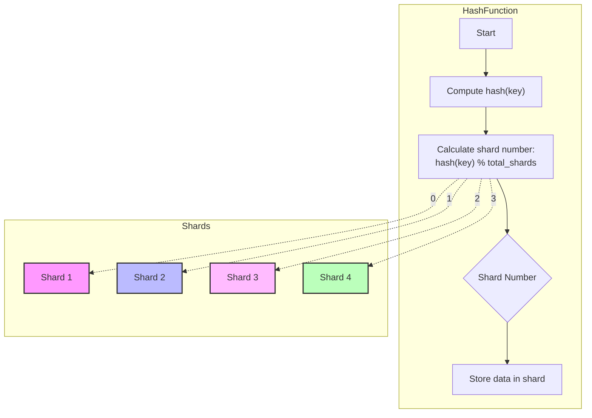
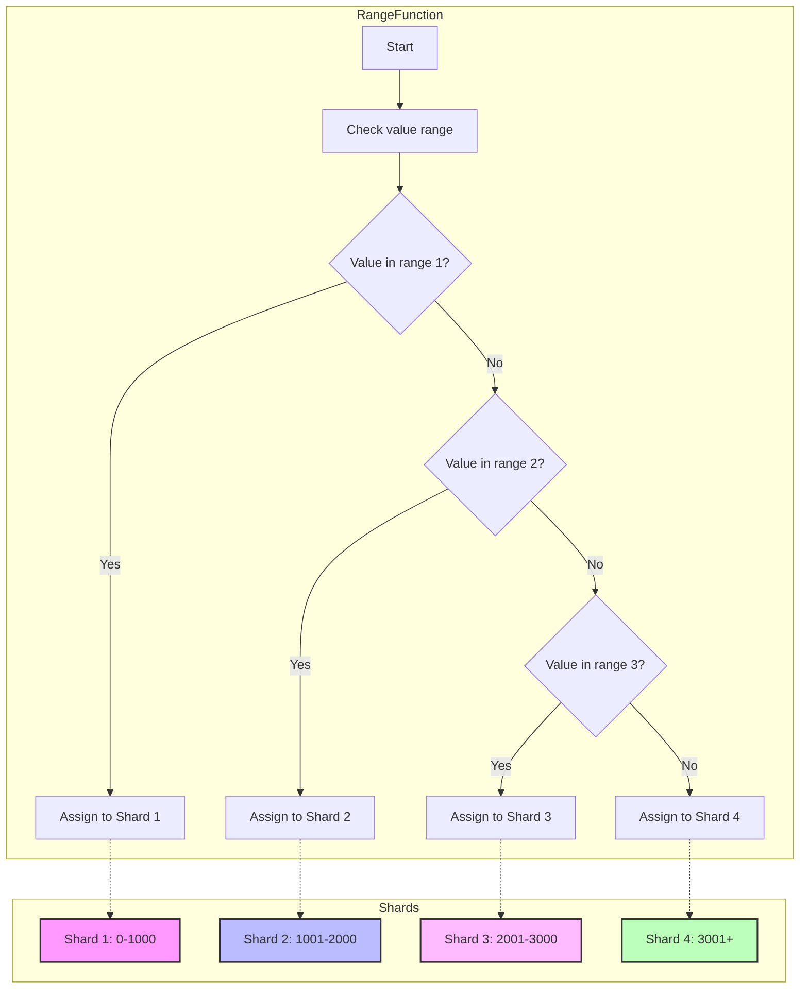
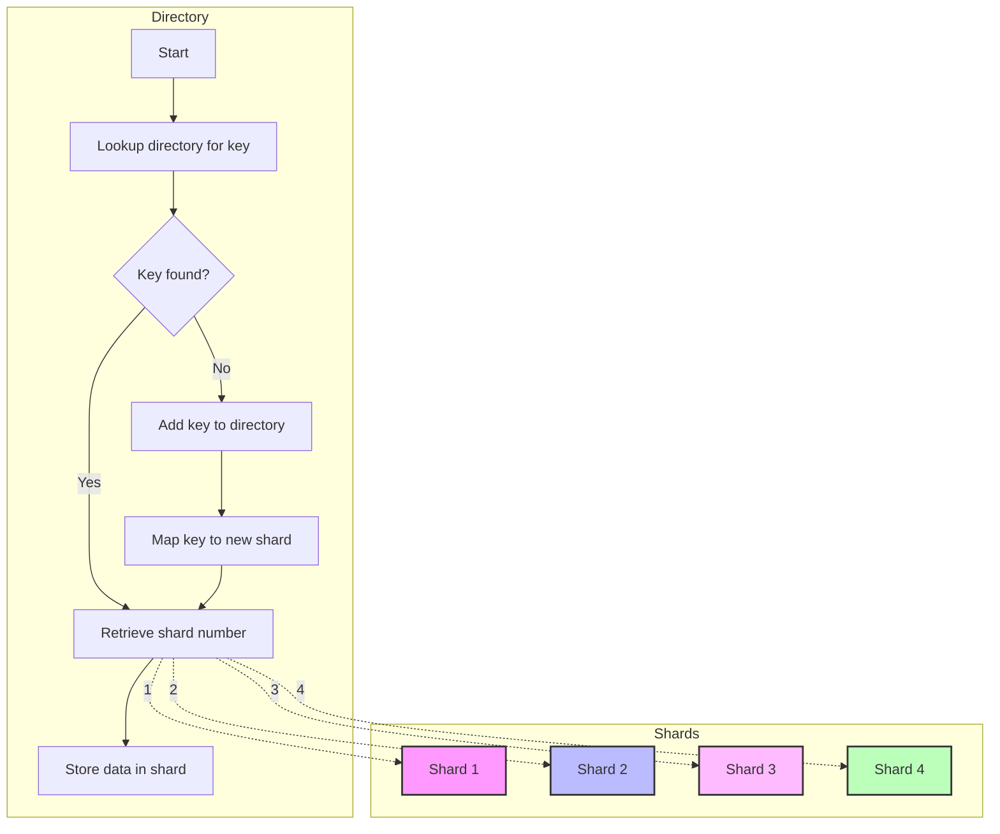
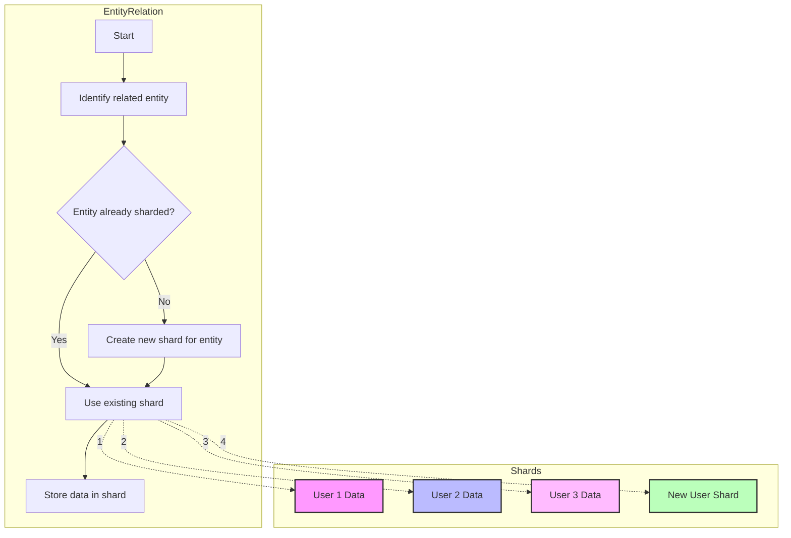
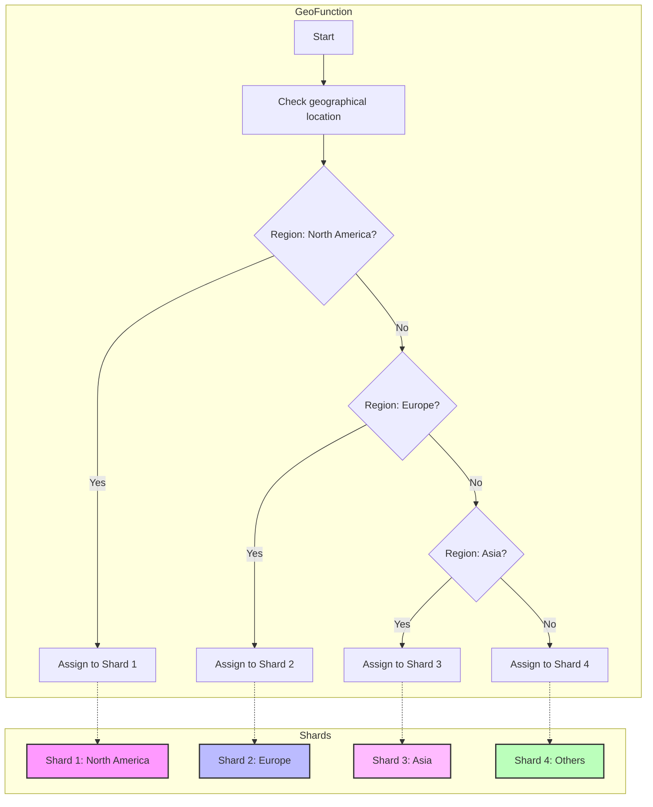
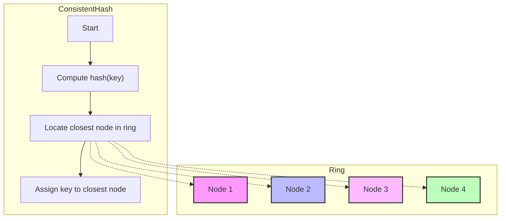
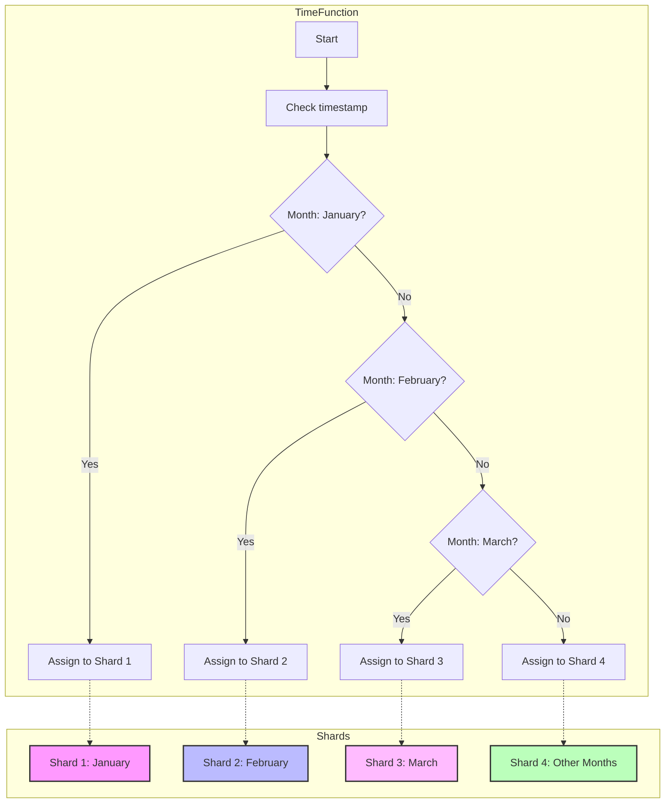

# Visual Guide to Sharding Algorithms

This guide provides advanced visual representations of key sharding algorithms using Mermaid charts. Sharding, a critical strategy for scaling databases, involves splitting large datasets into smaller, more manageable pieces (shards). This visualization highlights various sharding algorithms, showcasing their approaches for distributing data across shards. Each chart provides a structural flow of the algorithm, making it easier to grasp sharding strategies.

## 1. Hash-Based Sharding

Hash-based sharding is one of the most common strategies, where a hash function is used to determine the shard location.

## 2. Range-Based Sharding

Range-based sharding uses ordered ranges of values to decide shard allocation.

## 3. Directory-Based Sharding

In directory-based sharding, a central directory maps keys to shards.

## 4. Entity-Based Sharding

Entity-based sharding places related data in the same shard based on an entity relationship, such as user ID or account.

## 5. Geographical Sharding

Geographical sharding distributes data based on location.

## 6. Consistent Hashing

Consistent hashing reduces reallocation when adding or removing shards, ensuring minimal movement of keys.

## 7. Time-Based Sharding

Time-based sharding stores data based on temporal ranges.

This guide provides a comprehensive overview of sharding strategies, offering visual insights for advanced understanding of sharding techniques.
